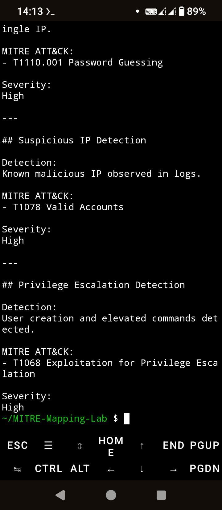

# MITRE ATT&CK Mapping Lab

A cybersecurity project demonstrating how Security Operations Center (SOC) analysts map detections, investigations, and threat hunting findings to the MITRE ATT&CK Framework to classify attacker behavior and improve detection coverage.

---

## Overview

This project demonstrates how SOC analysts use the MITRE ATT&CK Framework to classify security events, document attacker techniques, support incident investigations, and improve detection engineering.

The lab focuses on:

- Failed Login Mapping
- Brute Force Mapping
- Suspicious Authentication Activity
- Privilege Escalation Mapping
- Investigation Reporting
- ATT&CK Technique Classification

---

## Objectives

- Demonstrate MITRE ATT&CK mapping methodology.
- Map common security detections to ATT&CK techniques.
- Improve threat visibility.
- Support incident investigations.
- Produce professional SOC documentation.
- Demonstrate ATT&CK knowledge expected of SOC Analysts.

---

## Detection Coverage

| Detection | ATT&CK Technique | Severity |
|------------|------------------|----------|
| Failed Login Detection | T1110 | Medium |
| Password Guessing | T1110.001 | High |
| Suspicious Authentication | T1078 | High |
| Privilege Escalation | T1068 | High |

---

## Reports

- Executive Summary
- MITRE Investigation Report
- MITRE ATT&CK Mapping

---

## Future Enhancements

- ATT&CK Navigator Layer
- Sigma Rule Correlation
- Microsoft Sentinel Integration
- Microsoft Defender XDR Integration
- Wazuh Integration
- Sysmon Correlation
- Threat Intelligence Enrichment
- Automated ATT&CK Reporting

---

## MITRE ATT&CK Coverage

| Technique | ATT&CK ID | Description |
|------------|-----------|-------------|
| Brute Force | T1110 | Credential Access |
| Password Guessing | T1110.001 | Credential Access |
| Valid Accounts | T1078 | Defense Evasion / Persistence |
| Exploitation for Privilege Escalation | T1068 | Privilege Escalation |

---

## Investigation Workflow

Security Event

↓

Detection

↓

Threat Classification

↓

MITRE ATT&CK Mapping

↓

Investigation

↓

Incident Report

↓

Recommended Actions

---

## Screenshots

### MITRE ATT&CK Mapping



---

## Technologies Used

- MITRE ATT&CK Framework
- Bash
- Linux
- Termux
- Git
- GitHub
- Detection Engineering
- Threat Hunting
- SOC Operations

---

## Project Structure

```text
MITRE-Mapping-Lab
├── detections
├── mappings
│   └── mitre_mapping.md
├── reports
│   ├── executive_summary.md
│   └── mitre_investigation_report.txt
├── screenshots
│   └── mitre_mapping.png
└── README.md
```

---

## Learning Outcomes

- MITRE ATT&CK Mapping
- Threat Classification
- Detection Engineering
- Threat Hunting
- Incident Investigation
- Security Monitoring
- SOC Documentation

---

## Author

**Thabo Sakonta**

Microsoft Certified Security Operations Analyst (SC-200)

GitHub:
https://github.com/thabosakonta-wq

LinkedIn:
https://www.linkedin.com/in/thabo-sakonta-377a3748

---

## License

This project is provided for educational and portfolio purposes.

LinkedIn:
https://www.linkedin.com/in/thabo-sakonta-377a3748

License

This project is provided for educational and portfolio purposes.
